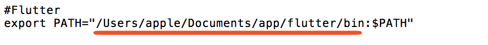
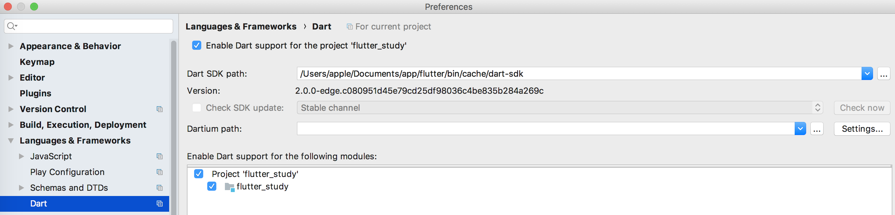

# IDEA搭建Flutter开发环境

### Flutter SDK安装

- 官方提供的安装地址:https://flutter.io/get-started/install

## 获取Flutter SDK

1. 下载以下安装包以获取Flutter SDK的最新beta版本（对于其他版本通道和旧版本，请参阅[SDK存档](https://flutter.io/sdk-archive/)页面。）：

   - [flutter_macos_v0.5.1-beta.zip](https://storage.googleapis.com/flutter_infra/releases/beta/macos/flutter_macos_v0.5.1-beta.zip) 

2. 在自定义应用安装位置解压文件，例如：

   ```Shell
   $ cd ~/development
   $ unzip ~/Downloads/flutter_macos_v0.5.1-beta.zip
   ```

3. 配置环境变量,红色划线部分根据所安装位置决定,配置到bin

   ```Shell
   $ open ~/.bash_profile
   ```

   

4. 第一需要执行环境监察命令

   ```Shell
   $ flutter doctor
   ```

   

5. 如果有可能需要更新一下Flutter

   ```shell
   $ flutter upgrade #更新Flutter SDK
   ```


### 跑起优秀项目

​	通常都会第一时间跑起别人比较优秀的项目,一般下载下来都会各种报错,SDk找不到的.这里先分享今天遇到的SDK一直找不到的问题.

​	


配置了Dart SDK到项目加载中

