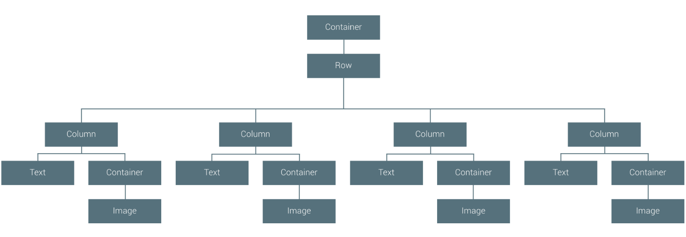
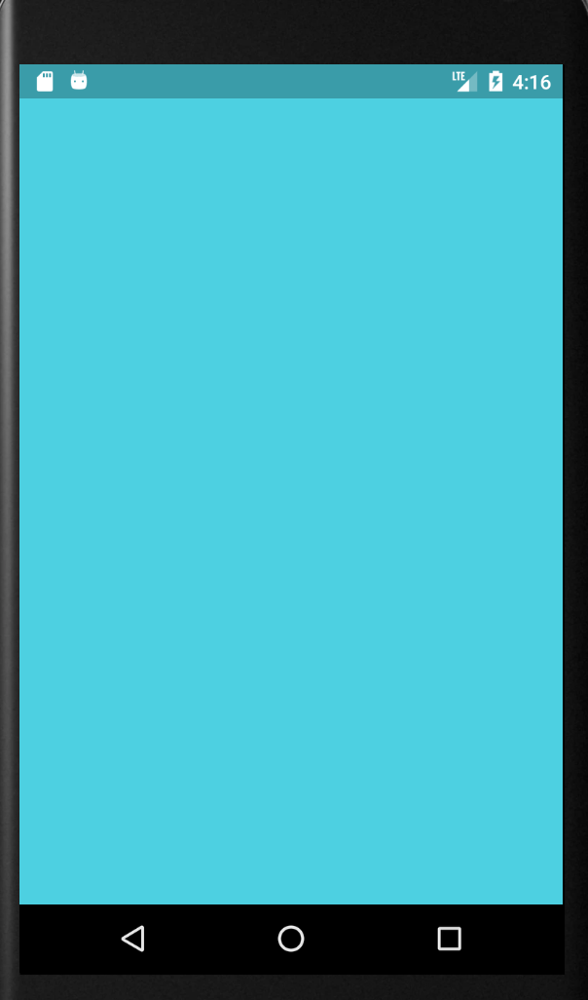
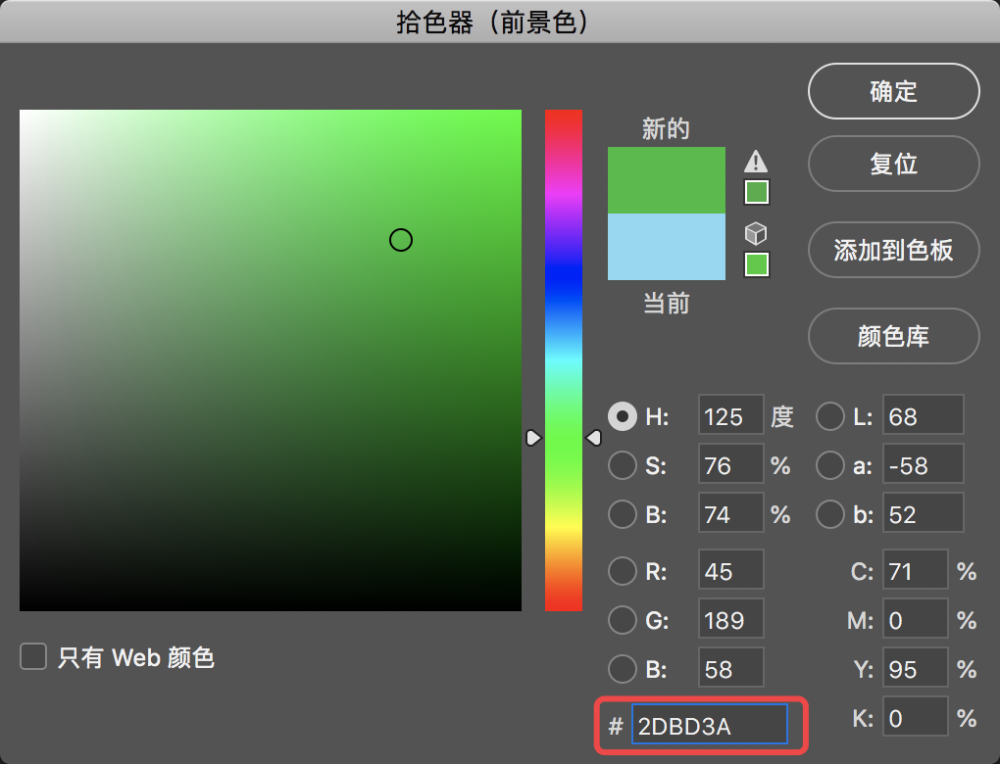
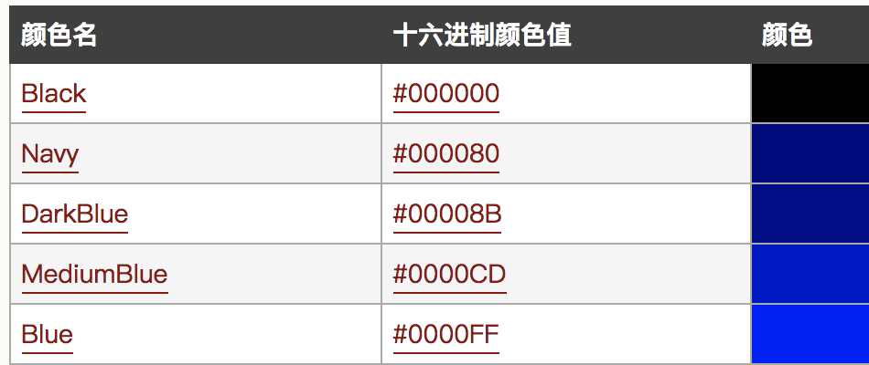
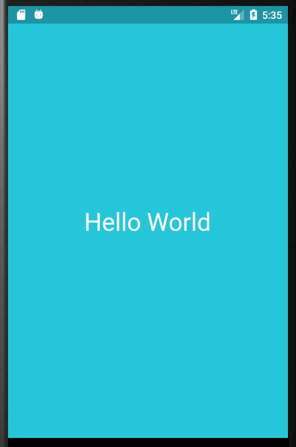

# 初体验


```Dart
import 'package:flutter/material.dart';

void main() => runApp(new MyApp());

class MyApp extends StatelessWidget {
  @override
  Widget build(BuildContext context) {
    return new MaterialApp(
      title: 'app的标题',
      home: new Scaffold(
        appBar: new AppBar(
          title: new Text('AppBar'),
        ),
        body: new Center(
          child: new Text('This Flutter Page'),
        ),
      ),
    );
  }
}
```


- 程序入口依然还是Main
- 类标记 java/kotlin/swift一样使用class
- Build 这个是android中常见的函数
- StatelessWidget类:一个不需要可变状态的小部件

## UI布局是怎么一回事

### 效果图



- 是不是和我们div布局是一样的,一层层的嵌套起来

## StatelessWidget 

- 最简单一种构造如下

```Dart
class MyApp extends StatelessWidget {
  @override
  Widget build(BuildContext context) {
    return new Container(color: const Color(0xFF2DBD3A));
  }
}
```

- 效果图

  

#### 

#### Container ?

 在新的代码引入了一个叫Container类,查了一下官方翻译过来是:一个便利的小部件，结合了常见的绘画，定位和大小调整小部件

**以下内容可跳过**

```markdown
在这里强调一点:本人是多语言开发,为了突破什么编程语言都只是简单的会用,达不到精通尴尬囧样,很多时候记录笔记都是按照自己快速记忆方式来记录,今后笔记中可能会反复提起,如果你感觉到笔者的笔记很浅薄,那么在很多我提出的关键字,最好搜索或者查询一下官方文档,理解了以后再接着看这份笔记,这样对你掌握一门新的语言有很大帮助.

# 为什么不能做到详尽的记录在笔记中呢?

 首先在开发中, 因为同时使用多门语言,精力和时间毕竟有限.为了更快,更好的完成工作项目.就需要花费大量的时间和自身长久的经验积累.笔者在使用任何语言编程都不排斥,但是为了能够同时使用多门语言,切换编程语言时就需要快速掌握基本语法,和一些快速开发的方式.基于这样的原因就有了现在这样一份快速开发笔记.
 总结性的话语和拓展性的会相对较少,没有专题博客那么详尽,笔者会根据自身的一个学习思路进行总结,大家可以按照这个思路快速的去掌握自己从来没有接触过的编程语言,编程思想.
 
 # 除了编程语言,还需要学什么?
 
 其实在这之前,笔者也是很迷茫,每次接触新的东西都很难再短时间内掌握,很多东西基本当天用了就忘,长期下来发现需要借助一些工具来帮我们记录! 人类需要掌握什么才能达到效能最大化呢? 因为脑容量的和个人智力开发非常有限,人的记忆存储神经元都是在消耗能源(ps:因为本人只是一个IT专业出身,一些其他专业术语仅作为参考,希望这些部分未来能有专业人士进行补充和修正) ,所以我们只需要掌握了思想,其余的只是表现手法和代码驱动而已.
```

从官方文档解释来看,Container几乎和我们html中提到的div容器是一个道理

```
new Container(color: const Color(0xFF2DBD3A));
```

这一段代码就是创建了一个颜色填充为#2DBD3A 的容器


### 16进制颜色值使用

#### Photoshop中的颜色

- 16进制颜色值表示法:

  ​	


#### Html网页16进制表示法




我们普片接触到的16进制颜色就是以上这些,通常还有一个透明度

#### 颜色值

```
0xFF2DBD3A
```

0x:表示16进制

FF:表示完全不透明(透明度)

2DBD3A:16进制颜色值


## 实现自定义效果

#### 


#### Container容器中加入一个text控件

```dart
import 'package:flutter/material.dart';

void main() => runApp(MyApp());
class MyApp extends StatelessWidget{
  @override
  Widget build(BuildContext context) {
    return Container(
      color: const Color(0xFF26c6da),
      alignment:FractionalOffset.center,
      child: new Text('Hello World',
          style: Theme.of(context).textTheme.display1.copyWith(color: Colors.white),
          textDirection: TextDirection.ltr
      )
    );
  }
}
```

进过一番文档查询

```Dart
 textDirection: TextDirection.ltr //万万不能省略 in Version:Flutter 0.5.1
```

- **alignment**  - 提供要应用于对齐子窗口小部件的[FractionalOffset](https://docs.flutter.io/flutter/painting/FractionalOffset-class.html)。包括
  bottomCenter，bottomLeft，bottomRight，center，centerLeft，centerRight，topCenter，topLeft和topRight

- 约束

  ```Dart
  constraints: new BoxConstraints.expand(  width: 200.0,) //怎么使用等我后面研究一下
  ```